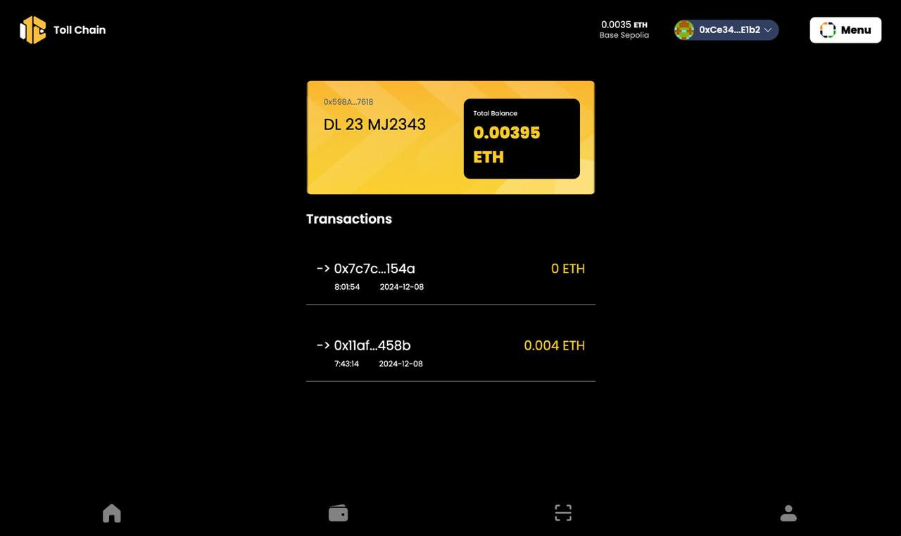
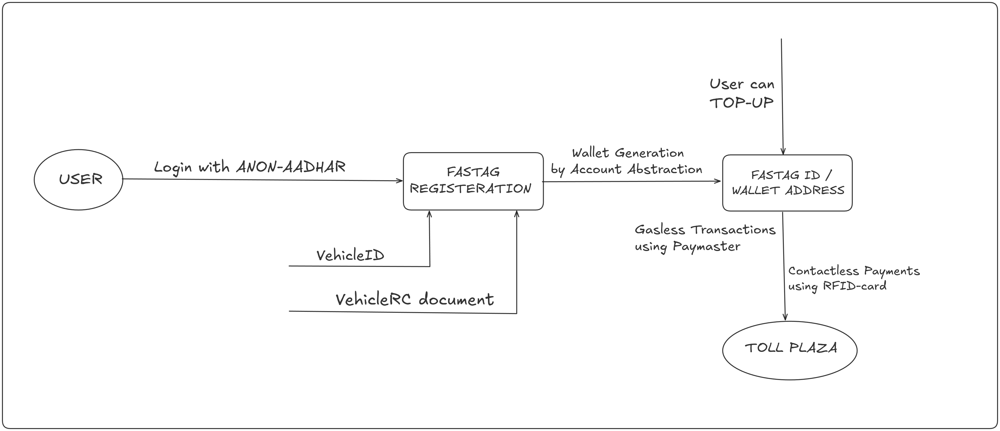

# TollChain

<!-- TABLE OF CONTENTS -->

  
Table of Contents

  <ol>
    <li>
      <a href="#about-the-project">About The Project</a>
      <ul>
        <li><a href="#built-with">Built With</a></li>
      </ul>
    </li>
    <li><a href="#constituents">Constituents</a></li>
    <li><a href="#problems-we-solve">Problems We Solve</a></li>
  </ol>

## About The Project

TollChain is a blockchain-based reimagining of FASTag that combines RFID technology with blockchain security. Users authenticate using [Anon-Aadhaar](https://pse.dev/en/projects/anon-aadhaar) and receive an account abstraction wallet mapped to their VehicleID. When a vehicle approaches a toll plaza, its RFID tag is scanned, triggering a smart contract that processes the payment automatically from the linked wallet. This system ensures privacy through anonymous authentication while maintaining transparency through blockchain's immutable ledger. The solution eliminates manual intervention and provides secure, automated toll collection with real-time balance updates. This helps in private user onboarding as user doesn’t have to share their aadhaar details completely.

(<a href="#readme-top">back to top</a>)

### Built With

[Next.js]: https://img.shields.io/badge/Next.js-black?style=for-the-badge&logo=next.js
[React.js]: https://img.shields.io/badge/React-blue?style=for-the-badge&logo=react
[Next-url]: https://nextjs.org/
[React-url]: https://reactjs.org/

- [![Next][Next.js]][Next-url]
- [![React][React.js]][React-url]
- [Foundry](https://hardhat.org/)
- [Scaffold-ETH 2](https://scaffoldeth.io/)
- [Anon-Aadhaar](https://pse.dev/en/projects/anon-aadhaar)
- [Coinbase Developer Platform](https://www.coinbase.com/en-ar/developer-platform)

(<a href="#readme-top">back to top</a>)

## Constituents

TollChain is made up of following components:

- **[web-nfc](https://github.com/namay26/eth-fasttag/tree/main/web-nfc)** - The UI for TollChain that allows users to create different FASTags and handle them smoothly.
  - [Anon-Aadhaar](https://pse.dev/projects/anon-aadhaar) - Aadhaar based verification for Indian users
  - [RFID-card](https://en.wikipedia.org/wiki/Radio-frequency_identification) - RFID card based scanner, for automated transaction.
- **[contracts](https://github.com/namay26/eth-fasttag/tree/main/contracts)** - Contains two contracts : One is the UserWallet - which is the account abstraction wallet , and Second is the WalletManager - which generates and maps these wallets to the user and the cars.

## Problems We Solve

1. **Security and Fraud Prevention** :

- Problem : Traditional systems face issues with unauthorized or double payments and cyber attacks
- Solution: TollChain uses blockchain's immutable ledger and smart contracts to prevent transaction tampering and ensure payment authenticity

2. **Privacy Concerns** :

- Problem : Current systems expose user data and vehicle tracking information
- Solution : TollChain implements anon-aadhaar for anonymous authentication and transactions are stored on chain , hence preserve user’s privacy

3. **Technical Failures** :

- Problem : Server downtime and hardware issues at toll plazas lead to delays and payment failures
- Solution : Decentralized blockchain architecture eliminates single points of failure and ensures continuous operation

4.  **Payment Reconciliation** :

- Problem : Disputes between operators and complex settlement processes cause delays
- Solution : Smart contracts helps to provide a record of ownership and Blockchain serves as proof of the historic transactions

(<a href="#readme-top">back to top</a>)

## User Flow / Architecture

## Contract Addresses

### Base Sepolia Testnet

- UserWallet.sol : `0x74e397BB2bC5FcDc15afe3184dEDd340d64712BC`
- WalletManager.sol : `0x33C6A4E07AFa99ff74648C4305C82349836D3615`
- Paymaster.sol: `0x972DA3a7cB9939e58d816E712624db2FD4392092`
